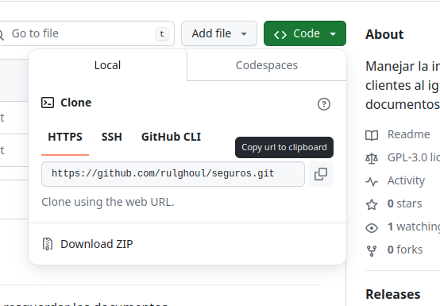

GitHub
#######

Git for Windows
----------------

Antes de poder descargar nuestro proyecto requerimos tener 
Git instalado en nuestro equipo, la forma mas facil de hacerlo en nuestro equipo es-mx
con la el programa que se descarga de la siguiente pagina

https://git-scm.com/download/win

El proyecto esta en un repocitorio de github, en la siguiente direccion

https://github.com/rulghoul/seguros

Solo se requiere clonar el codigo dando clic en el boton Code

si se tiene Git instalado procedemos a copiar la linea de HTTPS que se muesta y 
procedemos a usar GitBash en la carpeta donde deseamos descargar nuestro proyecto

.. code-block:: bash

    git clone https://github.com/rulghoul/seguros.git

Se descargara la rama main, para cambiarnos a la rama feature/traefik o feature/local debemos ejecutar el siguiente codigo

.. code-block:: bash

    git checkout feature/traefik

.. code-block:: bash

    git checkout feature/local

La rama *nueva* es donde se realizan los cambios principales, una vez probados 
normalmente se suben a la rama *dev* que es la rama principal de desarrollo donde todo funciona 

Instalación de Linux en Windows con WSL
########################################

En el caso de Windows se requiere instalar WLS para poder usar Docker,
esto requiere que el equipo sea compatible con instrucciones de virtualizacion, 
toda la informacion de como activar la virtualizacion y la configuracion viene explicada en
las siguinete pagina

https://learn.microsoft.com/es-mx/windows/wsl/install

En powerShell tenemos que ejecutar el comando siguiente que instalara Ubuntu en nuestro Windows

.. code-block:: bash
    
    wsl --install

Docker
#########

El aplicativo esta configurado para utilizar Docker para poder ejecutarse,
Se pueden editar algunos parametros en el archivo *docker-compose* para poder 
cambiar algunos valores en las variables de entorno, como son las contraseñas 
de la base de datos, dominios validos, la llave de seguridad de Django
y el usuario por default

.. code-block:: yml

    environment:
      SEGUROS_SUPERUSER_PASSWORD: "contraseñita"
      SEGUROS_SUPERUSER_EMAIL: "example@example.com"
      SEGUROS_SUPERUSER_USERNAME: "organizame.admin"
      DEBUG: 1
      SECRET_KEY: k$^m!=dp7ah&0_(9&0!b(47thue*@2x)u=883w3)1*pt8ae(i=
      SEGUROS_ALLOWED_HOSTS: localhost
      SEGUROS_CSRF_TRUSTED_ORIGINS: "http://localhost:1337,http://127.0.0.1:1337"
      SEGUROS_SQL_ENGINE: django.db.backends.postgresql
      SEGUROS_SQL_DATABASE: seguros
      SEGUROS_SQL_USER: seguros
      SEGUROS_SQL_PASSWORD: T3@tbycCM2Unz
      SEGUROS_SQL_HOST: db
      SEGUROS_SQL_PORT: 5432
      SEGUROS_REDIS: "redis://redis:6379"
      EMAIL_HOST_USER: "elmonjeamarillo@gmail.com"
      EMAIL_HOST_PASSWORD: "gzrlndcjrffjnrdt"
      EMAIL_DEAFULT_FROM: "elmonjeamarillo@gmail.com"
      MAX_FILE_SIZE_MB: 1
      RUL_ASU_BET: "_DVWRoqmwRLj-ywo5h0eD0Q="
      ALLOWED_FILE_TYPES: "application/pdf,image/jpeg,image/png,image/webp"

Crear los registros de Sepomex en la primera ejecucion
=========================================================

El aplicativo en puede no generar los registros
de la base de sepomex que requiere el sistema, para lo cual tendremos que editar
el archivo entrypoint.sh para que se generen la carga de la informacion a 
la base de datos.

.. code-block:: bash 
    :linenos:
    :emphasize-lines: 10,11

    #!/bin/sh

    # Detener la ejecución en caso de error
    set -e

    # Ejecutar migraciones
    python manage.py makemigrations --noinput
    python manage.py migrate --noinput

    #python manage.py loaddata sepomex_backup.json
    #rm sepomex_backup.json

    # Recopilar archivos estáticos
    python manage.py collectstatic --noinput --clear

    python manage.py crear_usuario

    # Opción con Gunicorn (asegúrate de tener gunicorn en tu requirements.txt)
    gunicorn --workers 4 -t 240 seguros.wsgi:application --bind 0.0.0.0:8000 --log-level debug --log-file - --access-logfile - --error-logfile -

Crea o actualiza las imagenes y ejecuta las imagenes de Docker
-----------------------------------------------------------------

.. code-block:: bash

    docker build . -t seguros:lasted && docker-compose down --remove-orphans && docker-compose up -d

